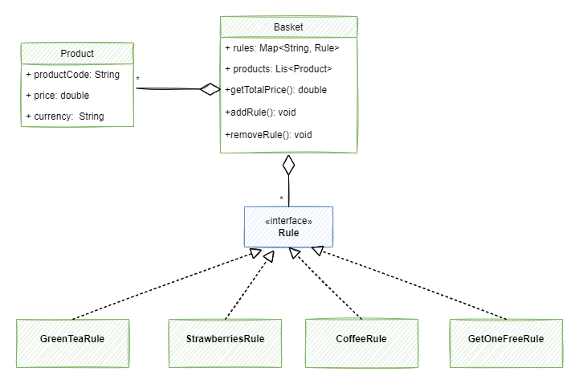

## Description: 
This is a java application that provides a **cashier function** which takes **two inputs**;
- the list of products in the basket
- the discount rules offered by the supermarket
 
and **returns** the total price of the basket.
 
## Design


## What's next?
- create other generic classes like GetOneFreeRule
- move rules configuration to a yaml file and write an adapter to read from this file and generate list of rules
```
rules:
- name: free-tea-rule
  type: get-one-free
  product-code: GR1
  n: 1
- name: strawberries-discount
  type: percentage-discount
  product-code: SR1
  n: 3
  percentage: 0.33
```
 
 